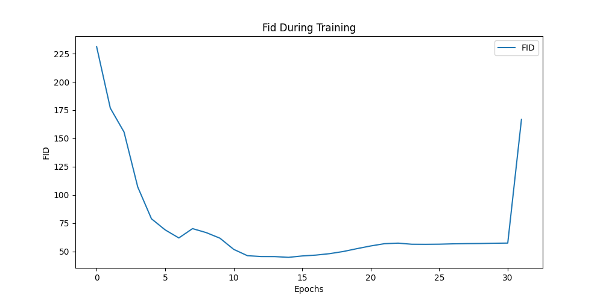
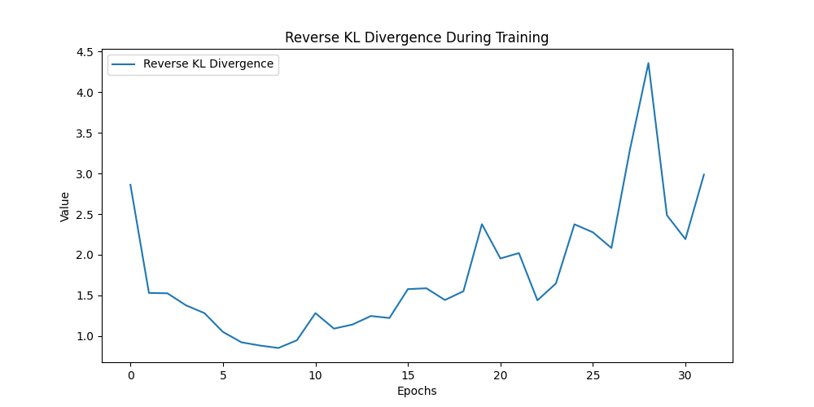
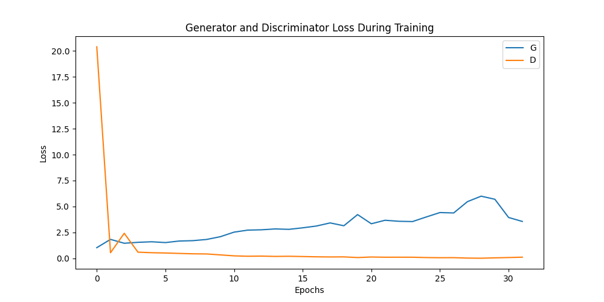
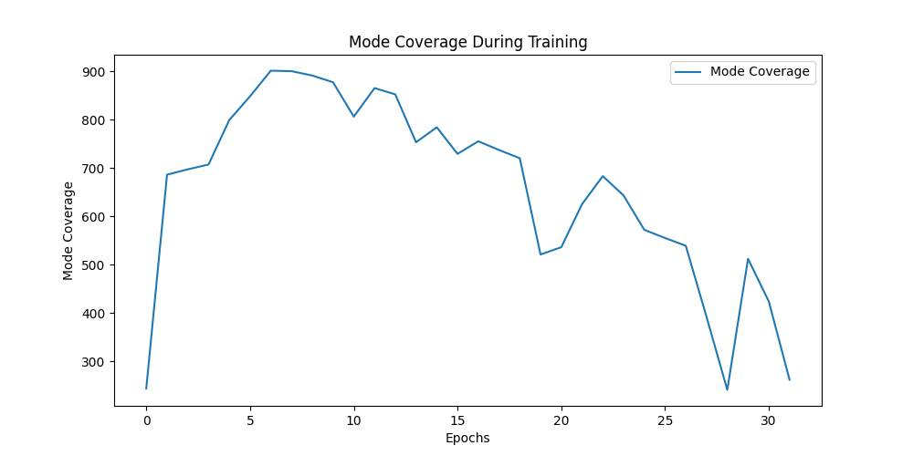
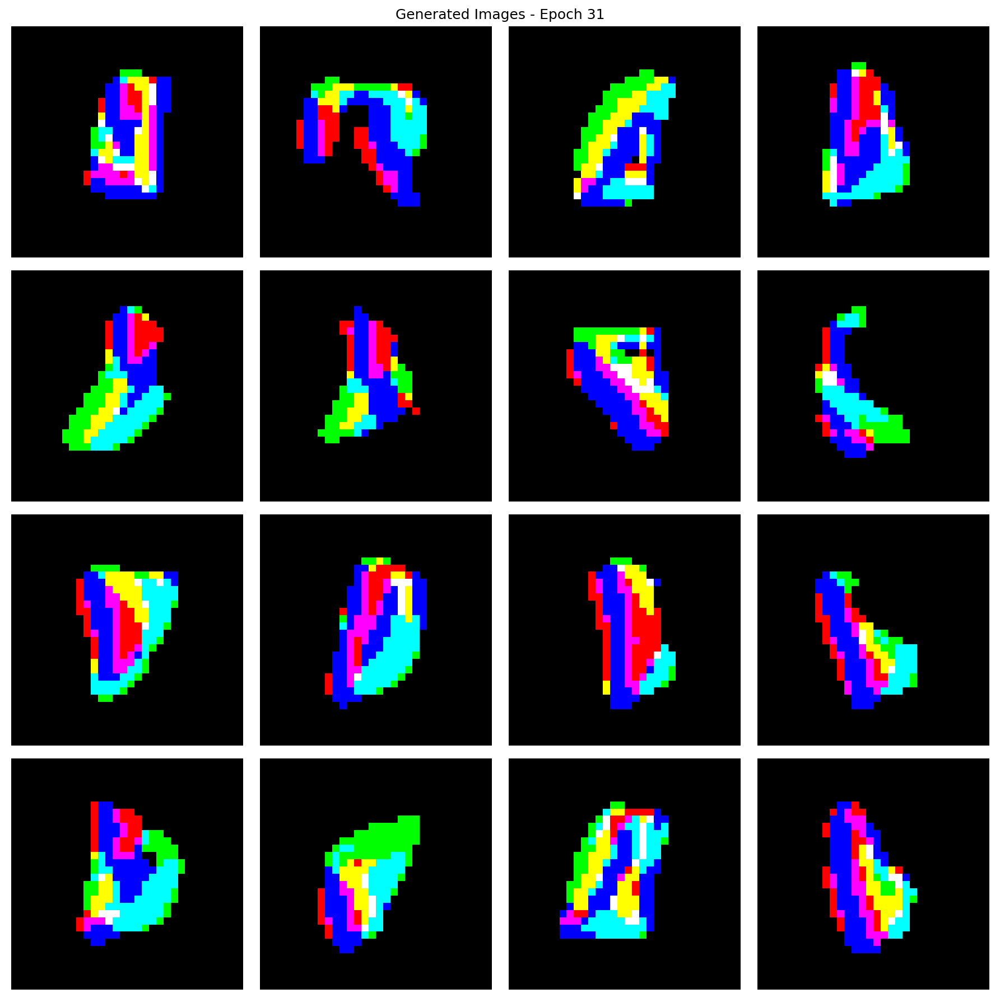

# Team 2 Final Submission for Advanced Machine Learning (20251R-DATA303)
- 2020170822 Minseok Kwon
- 2020320109 Taegyu Hwang
- 2022320331 Jiyoung Hwang

## Abstract

We focus on the reproduction and improvement of the paper titled **"The GAN is dead; long live the GAN! A Modern Baseline GAN."** Our implementation is based on the Stacked-MNIST dataset, where we applied improvements such as loss scheduling and attention mechanisms. Through a comparative analysis, we aimed to address key issues in the training process, including instability, mode collapse, and gradient vanishment, which are common problems in traditional GANs.

## Information

This code is based on the final paper submission and presentation materials. If you would like to check the paper (excluding reproduction content) and the final results of the reproduction and improvement experiments, please refer to the following link:

- [https://drive.google.com/drive/folders/18jmY8lqBs-5wVQ88kPy73aKHpDaZyCCm](#)

## Dataset
Stacked_MNIST uses the MNIST data from the following link, and a dataloader will be automatically created. For CIFAR-10 and ImageNet-32, download the data from the provided link, and for FFHQ-64, the data will be downloaded directly by the code from the provided link without the need for a separate download. All data should be placed inside the 'data' folder.

1. StackedMNIST
https://paperswithcode.com/dataset/stacked-mnist

2. CIFAR - 10
https://www.cs.toronto.edu/~kriz/cifar.html

2. FFHQ-64
https://huggingface.co/datasets/Dmini/FFHQ-64x64

3. ImageNet-64
https://www.image-net.org/download-images.php

## Setting

The code was trained using 4 × RTX 4090 GPUs (VRAM = 48GB) over approximately 7 hours of parallel training. A minimum of one GPU with at least 128GB of VRAM is required for the experiments.

To set up the environment, create a virtual environment using the provided `requirements.txt`. The Python version and CUDA version are flexible, but if you encounter any issues, please install the necessary dependencies. 

```bash
# To create the virtual environment and install dependencies
python -m venv venv
source venv/bin/activate  # On Windows, use venv\Scripts\activate
pip install -r requirements.txt
```

If you face any errors, you might need to install additional dependencies depending on your setup (e.g., specific Python versions or CUDA configurations).

## Run

The code works with the Stacked-MNIST dataset by default. Both training and image generation run simultaneously, with the results, checkpoints, and generated images stored in the `log` and `result` folders.

To start training and generation on 4 GPUs, use the following command:

```bash
torchrun --nproc_per_node=4 main.py
```

If you want to run the model on other datasets, adjust the following parameter in `main.py` to select the dataset:

```python
'''
    img_type
    dataset 1 : Stacked MNIST
    dataset 2 : FFHQ-64
    dataset 3 : CIFAR-10
    dataset 4 : ImageNet-32
'''
img_type = 'd1'  # Change to 'd2', 'd3', or 'd4' as needed
```

If you want to run the model on other setting of improvement, adjust the following parameter in `main.py` to select the options:
1. change applying attention mechanism
```python
use_mhsa = False # Change to True 
```

2. change applying switching loss
```python
switch_loss = False # Change to True 
```

## Result
1. Training Visualization






Upon examining the loss graph, it was observed that from the middle of training, the generator's (G) loss begins to diverge compared to the discriminator's (D), indicating an imbalance. This imbalance is also reflected in the mode coverage graph, where coverage does not improve significantly. To address this, additional techniques need to be developed to help the generator converge, which is essential for producing higher-quality images.

2. Generated Image



The generated images from Stacked MNIST show that each RGB component forms distinct boundaries in the early stages of generation. However, due to a limited number of epochs and the generator's divergence, the quality of the images does not improve further. This highlights the need for further optimization to enhance image quality.


